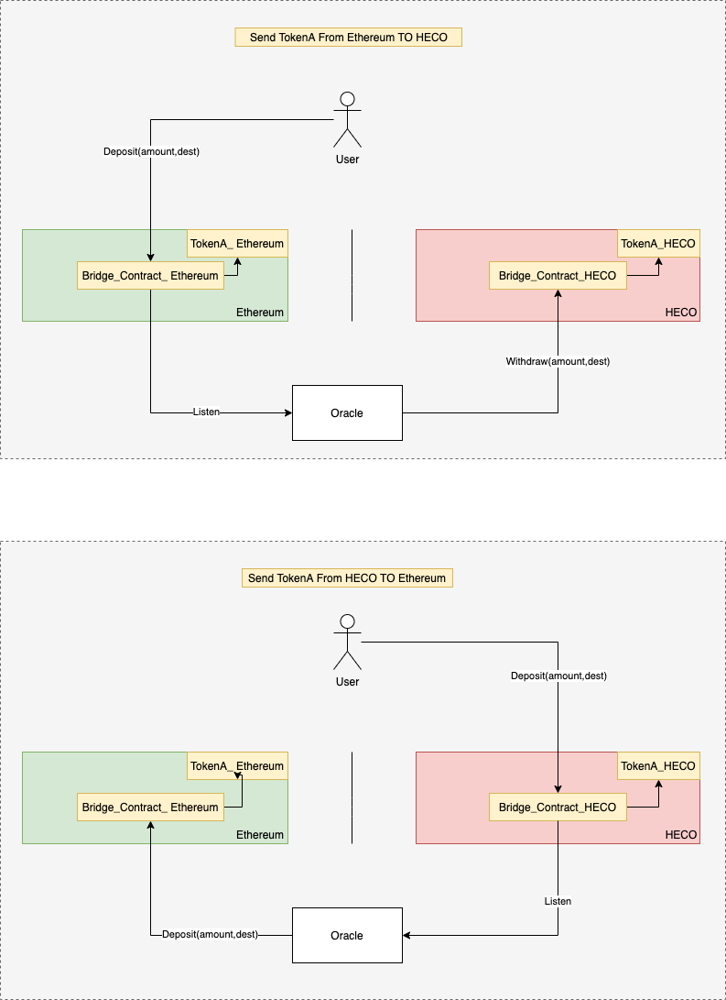

# Introduction
This document introduce the basic info of hsc bridge:

Contract Address：

Ethereum： [0xa929022c9107643515f5c777ce9a910f0d1e490c](https://etherscan.io/address/0xa929022c9107643515f5c777ce9a910f0d1e490c)

HSC: [0xa929022c9107643515f5c777ce9a910f0d1e490c](https://hscscan.com/address/0xa929022c9107643515f5c777ce9a910f0d1e490c)

# How it works

# Application for token-peg

The process is:：

1）Submit application

contact bd or <devcontacts@hoo.com>

2）Deploy token contract

3）Testing

4）Online