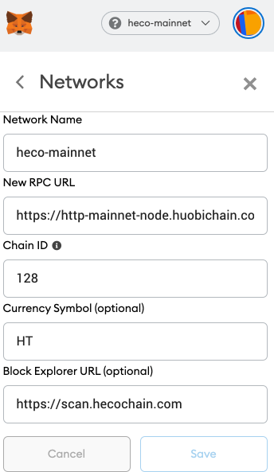

# Summary

Hsc support metamask

> NOTE: Check compitibility before using wallet, Ledger is not supported.

# metamask

add custom network：

## mainnet

download url：https://metamask.io/

```
chainid: 128
rpc: https://http-mainnet-node.hoochain.com
scan: https://hscscan.com
```



## testnet

```
chainid: 256
rpc: https://http-testnet.hoosmartchain.com
scan: https://testnet.hscscan.com
```

# cointtype for Hsc

https://github.com/satoshilabs/slips/blob/master/slip-0044.md